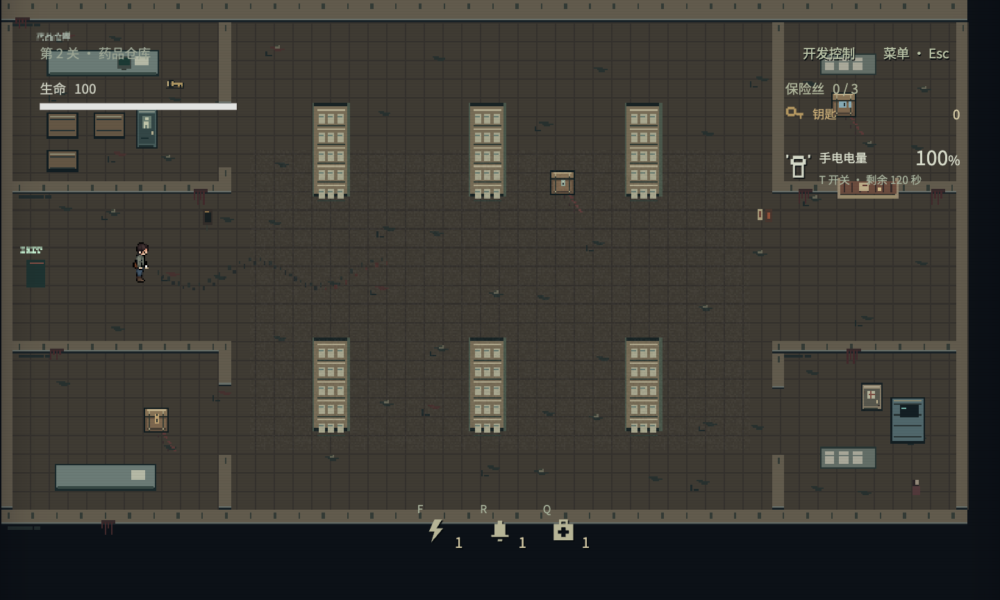
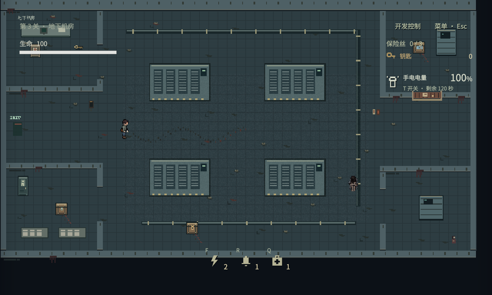
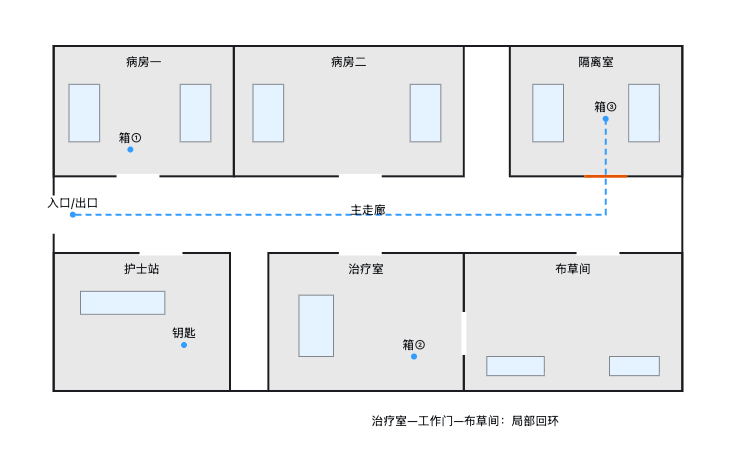
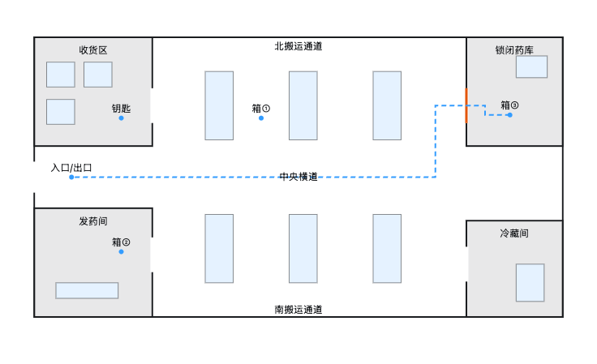
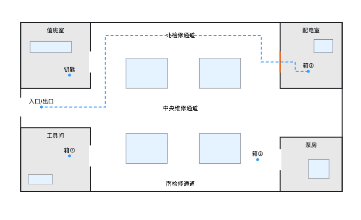
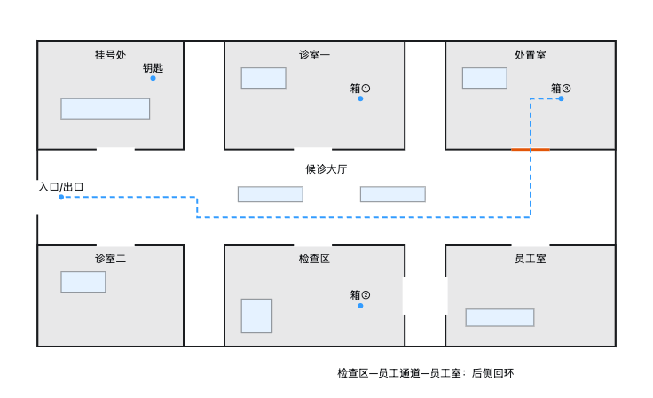
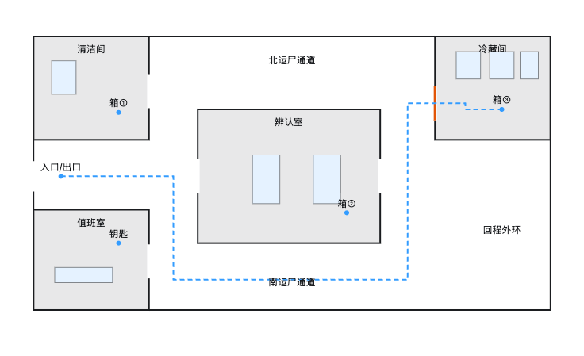

# 医院地图布局方案 v1

## 当前进度：原三图已扩图，新增门诊与手术室

病房、药品仓库、地下机房均已实现为 1280×768。三张地图共用分用途物资池和 Optional*Zone 可选家具区域；首关固定，后续局部随机。门诊部与手术室已注册为第 4、5 关；太平间已按双平行通道方案注册为第 6 关，详见 `morgue-validation.md`。本文下方保留原始设计提案，当前实现与验证见 `clinical-maps-validation.md`。

仓库采用六组平行高货架、三条搬运横道及收货/发药/冷藏/锁闭药库；机房采用四组大型机组、外围检修环及值班/工具/泵房/配电室。高货架和机组使用独立绘制，并完全阻挡光线。

当前实机布局总览（暂停、缩小镜头、关闭光照遮暗，仅供评审）：

验证与限制见 [仓库与机房验证](industrial-maps-validation.md)。下方病房阶段和初版图为设计过程记录；实现以 LDtk 源文件为准。

## 病房扩图试验（已进入开发）

用户确认先将病房扩大到 1280×768，画布面积较 960×576 增加约 78%；角色与病床保持原尺度。下文初版图仍作为空间意图记录，以 `maps/ward.ldtk` 中的新布局为当前实现。

- 北侧两间普通病房与单入口隔离室；南侧护士站、治疗室、布草间。主廊净宽 104，工作门连接治疗室与布草间。
- 保留三箱与原钥匙链，不加新机制、必拿物品或强制等待。首关固定教学摆放，后续病房轮次按功能区随机：铜钥匙在护士站，无锁箱在普通病房，铜锁箱在治疗室或布草间，封箱在隔离室。
- 新增区域接入照明、家具、可选补给与藏身柜候选区域；装饰位置由 LDtk 锚点控制。房间名为内部功能区名称，本次没有新增玩家文案。
- 两套固定摆放的最短撤离距离为 1088 / 1136 世界单位，旧版为 776 / 776。长度按碰撞与开箱/出口交互半径计算，不能直接推断正常玩家局长。
- 产品方向以可重复直播循环为先：布局清楚、整蛊能介入、重复操作顺畅；不预设 6–8 分钟目标，也不承诺面积增长会等比例增加观众互动或收益。

构建、随机性和实机验证记录见 [病房扩图验证](ward-expanded-validation.md)。以下为先前规划背景，并非所有科室均已实施。

2026-09-08；策划分支 `codex/hospital-new-levels`。本次为功能分区与空间布局提案，未修改 LDtk 或运行时代码，未完成游戏内碰撞、距离与通关验证。

## 本轮目标与顺序

先设计废弃病房、药品仓库、地下机房，再补门诊部、太平间。先让空间本身有用途、秩序和记忆点，再加入环境机制。现有搜寻与撤离规则保留，新增机制不作为本轮布局成立的前提。

平面图使用现有 960×576 画布作为比较尺度，房间、门洞、家具及教学物资位置均为建议位置。图中“箱①”为无锁箱，“箱②”为铜锁箱，“箱③”为锁区封箱；“钥匙”为铜钥匙。线条为撤离方向示意，不是寻路或最短距离计算结果。地图以游戏空间可读性为目标，不声称符合真实医院建筑规范。

## 现状证据

核对本分支 `game/maps/{ward,warehouse,plant}.json`、`game/levels.json`、`docs/random-maps.md` 和 `src/runtime/level-validation.ts`：

- 三图画布都是 960×576，出生点均为 (458,318)，出口均为 (65,319)，锁门均位于 (770,263)，门的交互点均为 (801,296)，四盏注册灯也使用相同坐标。
- 病房已有中央走廊、上下分室和成对病床，具有部分秩序；问题是下方房间用途表达薄弱、主要单出口，空间体验比较单一。不能把三张地图都概括成完全随机摆放。
- 仓库货架上下两组分别从 x=120/300/480 与 x=160/340/520 起排，混有错位短墙；机房四个小机器分散在 (110,136)、(270,392)、(545,213)、(782,412)，缺乏明确的设备大厅和检修结构。
- 当前随机化主要改变预设搜寻点，固定墙和家具不再随机重组。因此问题应通过重设计 LDtk 解决，不能只调整随机种子。

## 五张地图的空间区别

| 地图 | 平面骨架 | 一眼可认的地标 | 主要路线选择 |
| --- | --- | --- | --- |
| 病房 | 单条主廊，两侧房间，一处工作间回环 | 面向走廊的护士站、成对病床 | 主廊快但暴露，治疗室与布草间局部绕行 |
| 仓库 | 整齐货架阵列，北中南三条横道，收发货前场 | 同向高货架、收货托盘 | 沿不同货架通道切换，在端头确认危险 |
| 机房 | 中央四组机组，外围完整检修环，附属工作间 | 中央大型机组、靠墙管线 | 穿中央维修通道，或沿外围绕过机组 |
| 门诊 | 候诊大厅为中心，诊室围绕，后侧工作通路 | 挂号窗、候诊椅和门灯 | 大厅直接通行，检查区后门提供局部绕行 |
| 太平间 | 连续运尸外环，中央辨认室，后侧冷藏间 | 沿墙冷柜、中央白布推床 | 绕外环，或穿双门辨认室 |

## 1. 废弃病房：先做样板

北侧布置两间普通病房和东端单入口隔离室。床头统一靠北，床侧与床尾留连续通路，不在走廊中央摆床。南侧从西向东为护士站、治疗室、布草间，护士站对准主廊，工作台放在站内。

主廊净宽初稿约 100 世界单位。治疗室和布草间各向主廊开门，中间通过工作门相连，形成一处有功能理由的回环；普通病房不为追逐随意开穿墙通道。隔离室没有可绕过锁门的后门。

教学样例：先在护士站拿铜钥匙；病房一的无锁箱提供病区门钥匙；治疗室铜锁箱提供封箱钥匙；两路准备完成后进入东端隔离室开封箱，再沿主廊回西侧出口。两条准备路线允许交换先后。

局部异常只选一处：病房二的一张床被拉离床头墙，留下地面拖痕。它仍须保留可通行床尾，不靠堵门增加难度。

本轮工作门可先做固定通行门洞。多扇可关房门涉及当前单门模型、怪物寻路与状态管理，属于后续机制，不能把图上门洞当成已支持的交互门。

## 2. 药品仓库：先有搬运秩序

西侧是收货区与发药间，东侧是锁闭药库和冷藏间，中部货架统一朝向、轴线对齐。北侧、中央、南侧横道连接所有取货通道；货架端头不再放无功能的短墙。托盘与散箱集中在收货区，不能散落整张图。

教学样例：收货区铜钥匙，中部货架无锁箱，发药间铜锁箱，东侧药库封箱。返程穿过横道，玩家可以在多个架间通道切换方向。

高货架应阻挡视线，低托盘应表现出不同遮挡关系；原型阶段先验证遮挡与碰撞轮廓一致。隔着架子看见追兵、却无法判断是否会被发现，会破坏设计目的。

图示东侧药库到西侧出口的路线较直接。落地时必须计算实际最短撤离距离；若不满足现有 600 世界单位下限，优先沿货架轴线增加合理进深或调整收发货口，不临时插短墙凑距离。

## 3. 地下机房：设备决定通道

四组大型机组集中在中部，轴线一致；中央留横向维修通道，外围留完整检修环。西侧是值班室、工具间，东侧是配电室、泵房。管线沿墙或跨设备上方连接，控制柜前保持操作面，不把管线画成能走却撞上的隐形障碍。

教学样例：值班室铜钥匙，工具间无锁箱，泵房外检修点铜锁箱，东侧配电室封箱。撤离可从北检修通道绕行，也可经中央维修通道回出口。

即使没有机器掩盖脚步的新机制，这张图也应通过大体量机组和绕行距离产生区别。机器启停与噪声掩护留到布局试玩后。

## 4. 门诊部：随后补充

中央候诊大厅连接挂号处、诊室一、诊室二和处置室。候诊椅同向成组，中间留过道；普通诊室单入口。检查区与员工室通过后侧员工通道形成唯一局部回环，避免为了逃跑把每个诊室都做成穿堂。

挂号处铜钥匙，诊室一无锁箱，检查区铜锁箱，处置室封箱，西侧大厅出口。它与病房的区别是大厅分配多个方向，而非长走廊串起多个房间。

叫号引怪是后续候选机制，先验证静态大厅、椅排及后廊能否形成清楚的路线选择。

## 5. 太平间：随后补充

入口附近安排值班室和清洁间；辨认室位于中央，东西两门连接连续运尸外环；冷藏间位于后侧且单入口锁闭。冷柜沿墙，推床按停放位排列，运尸转角留推床尺度的空间。

值班室铜钥匙，清洁间无锁箱，辨认室铜锁箱，冷藏间封箱。返回时选择穿中央辨认室，或沿外环绕行。不能让尸袋、推床和藏身柜使用相同轮廓造成交互误认。

本版先做静态冷柜。抽屉伸出堵近路暂不纳入布局验收；以后引入时不能堵外环，也不能使锁区或主线搜寻点失去可达性。

## 摆放与随机规则

- 功能分区、外墙、主通道、家具轴线、锁区和主要地标固定。先画区域和通道，再在其内部放置家具。
- 家具靠墙或成组摆放，物资靠工作台、储藏柜与设备操作点；不把教学物资随机扔在空地中央。
- 铜钥匙、无锁箱、铜锁箱按各自可解释的房间集合随机，不能继续完全混用一个 open 点池。封箱只在锁区内局部变化。先做固定教学样例，再做有约束随机。
- 初稿主通道约 90–110、次通道约 60–80、门洞约 56 世界单位；这是规划尺寸，需以角色与追兵实际身体尺寸、转角、交互半径和镜头验证，不能当作已验证规格。
- 出口保持先能看见、最终才可使用；首见地标和第一次安全遭遇不依赖阅读房间名。
- 追兵节点放在不直接被看见的合理入口，并保留出生距离。哭泣患者只放可选侧区，不能用其警觉圈封住唯一主路或工作门。
- 地图不是一次显示全图：按当前 640×384 内部视口检查，每个关键分岔附近至少能辨认一个地标。

## 下一步制作与验收

1. 先评审病房的主廊、房间用途与唯一局部回环，再以它建立床、门、墙、通道的统一尺度。
2. 制作病房 LDtk 灰盒和固定物资样例；验证现有钥匙链及锁区无绕过路径、撤离最短距离、角色/追兵碰撞与实际镜头可读性。未达到可读性要求前不铺正式美术。
3. 同样完成仓库、机房，再新增门诊部与太平间；每张都做完整搜寻到撤离的浏览器验证。
4. 最后接入局部随机、事件和特色机制，避免同时修改几何和怪物行为，无法判断改善来自哪里。

本轮完成的是平面方案和静态图。没有以概念图代替 LDtk，没有宣称上述净宽、回环和撤离时长已通过实机检查。落地时遵守项目本地化约定，房间名与玩家可见指引全部接入语义键和必需语言。
