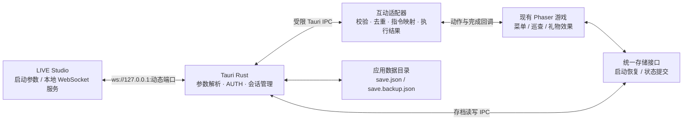
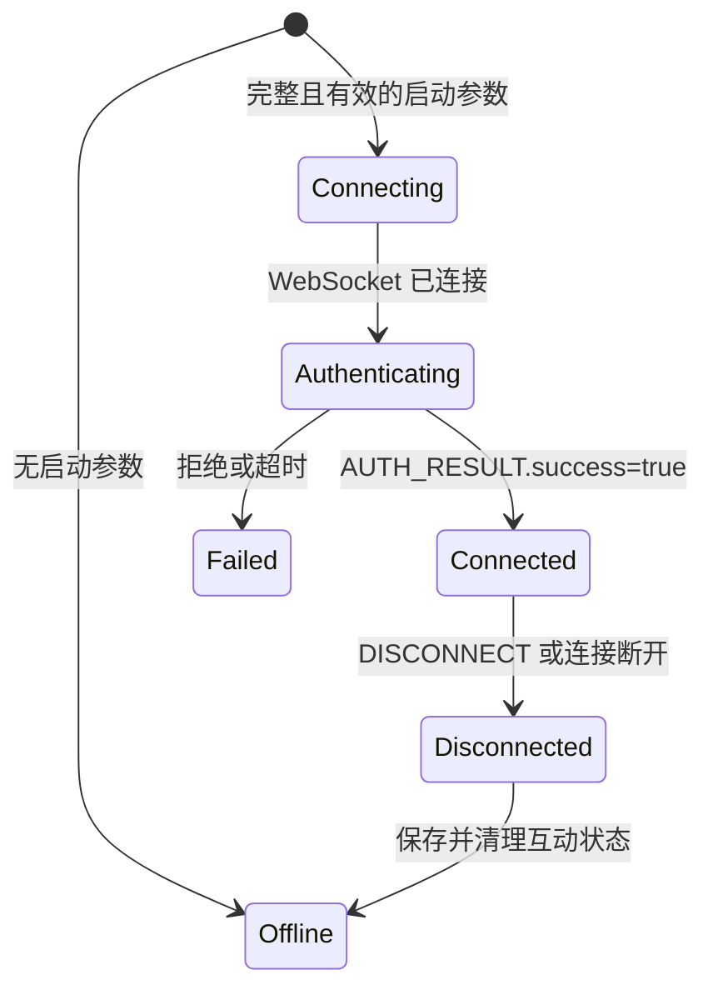

> 0.4.1 实现状态与最终行为见 [桌面构建说明](./desktop-builds.md)。以下保留方案背景；存档隔离以用户后续确认的 play_id 为准，不迁移旧存档。

# 本地桌面版、自动存档与 TikTok LIVE Studio 接入方案

## 范围与当前状态

从 `codex/cold-hospital-cover` 的 `0badfd579e9415cf5453e8048dd0b8de8413393d` 建立 `codex/local-desktop-tiktok`。独立工作区为 `/Users/bytedance/workspcae/night_shift-desktop`，不改动原工作区中的翻译、素材和其他未提交工作。

本轮迁入已验证过的 Tauri 打包实现，并制定后续开发方案。**文件自动存档、LIVE Studio 通信和执行 ACK 尚未实现。** 本文中的模块、数据结构与行为约定均为拟实施内容，不能作为功能已完成或平台已联调的证明。

用户已确认首版存档范围：保存解锁进度、设置和历史；中途退出后从本夜开头重玩。首版不恢复玩家坐标、敌人状态、局内道具或互动队列。

协议依据：[LIVE Studio 本地游戏接入文档](https://bytedance.larkoffice.com/wiki/JQaDwDOG2i7x19kG1eicpiqKnwL)，读取于 2026-09-10，文档 ID `Qsxod6NgPoE0MSxfEoklvLfYgoe`，revision `1286`。下文明确区分文档规定、本项目设计和待确认事项。

## 现有代码与需要补齐的能力

| 范围 | 当前事实 | 首版目标 |
| --- | --- | --- |
| 本地运行 | Tauri 内置完整前端和资源，原生全屏已接入 | Windows 绿色 ZIP 为主要交付，NSIS 与 macOS DMG 保留 |
| 解锁进度 | `src/campaign.ts` 将 `unlocked` 写入 localStorage | 改由统一存储接口持久化到桌面存档文件 |
| 语言与教学 | `src/i18n.ts` 保存语言；`runtime/tutorial.ts` 保存已学怪物教学 | 一并迁移，保持现有语言回退与教学规则 |
| 音频设置 | `src/ambience.ts` 保存音乐轮换；`main.ts` 每次将声音开关初始化为 true | 保存开关、音量和轮换选择，启动时恢复 |
| 历史 | `runtime/run-history.ts` 保存最近 30 局结算 | 保留上限，和解锁进度一起提交，避免二者不一致 |
| 互动 | `main.ts` 支持开发用 SSE；`LiveGifts` 接收 giftId/count/runId | Rust 本机 WebSocket 客户端接收正式协议，再转换为游戏动作 |
| ACK | `receiveGift()` 返回是否接收，部分效果之后才执行 | 为每条指令跟踪实际执行结果，完成后再 ACK |

桌面存档不能只等同于 WebView 的 localStorage：后者虽可跨进程保留，但缺少应用控制的版本迁移、损坏恢复、备份与更新保留约定。

## 总体结构



不增加 Node.js sidecar、本地 HTTP 服务或公网 Webhook。Rust 负责操作系统能力和通信；Phaser 保留玩法规则。网页构建继续使用浏览器存储，桌面构建使用文件存储。

## 本地打包

### 交付与目录

1. Windows 首版使用 x64 ZIP，EXE、游戏 icon 和所需文件放在 ZIP 根目录。前一次提供的手动测试 ZIP 带了一层父目录，平台交付脚本需要去掉这层。
2. 程序继续内置 WebP、Opus、字体和全部必需语言。构建输出独立的 `dist-desktop/`，清空 CDN 和 SSE 配置，保留本地资源一致性校验。
3. Windows 使用系统 WebView2；普通下载渠道另提供按需补装运行库的 NSIS。LIVE Studio 的 ZIP 启动链路是否保证 WebView2，需要平台确认。不能把“多数电脑已有”当成平台依赖保证。
4. 如果平台不负责运行库，后续可增加包含 Fixed Version Runtime 的专用包。把 Evergreen 离线安装器放进 ZIP 仍需执行安装，不满足严格的完全免安装要求。
5. macOS 保留 Apple Silicon / Intel 分包和 macOS 15.4 最低版本。Mac 可做单机与模拟协议测试；目前参考文档不能证明真实 LIVE Studio 本地启动链路支持 macOS。
6. 存档、临时文件和日志放在稳定的用户数据目录，不放在 EXE 旁边。替换程序目录、版本更新或移动 ZIP 解压目录不应丢失存档。

新增 `scripts/package-desktop.mjs` 负责根目录 ZIP、文件列表、字节数、SHA-256 与构建来源记录。用户已确认平台 `game_id` 为字符串 `7682641099949034247`，配置在 `game/live-studio-instructions.json`，后续 AUTH 与交付配置共用此来源，不经过 JavaScript Number 转换。

### 平台资源规范的适用边界

参考文档第 3 章标明“这部分仅作参考，实现时不用关注”，且 manifest 小节追加“由构建系统分割 chunk 后生成，不需要游戏侧提供”。因此首版生成本地交付清单用于核验，**不自行实现平台分块、签名或增量更新协议**；平台最终 metadata/manifest 格式在交付联调时确定。

本项目不主动上传资源，也不添加另一个更新器。平台安装、更新、卸载程序目录与用户存档保留约定须对齐；不能承诺当前平台已经支持删除我们选定的数据目录。

## 本地自动存档

### 保存内容

| 数据 | 内容 | 保存时机 |
| --- | --- | --- |
| 进度 | 已解锁夜次、最近开始的夜次 | 通关结算、开始新一夜 |
| 设置 | 用户语言选择、声音开关、音量 | 用户修改；音量拖动可合并短时间内的更新 |
| 教学 | 已完成的怪物教学 | 教学确认完成 |
| 音乐轮换 | 各场景上次使用的曲目 | 选定新曲目 |
| 历史 | 最近 30 局的现有结算信息 | 胜利或失败结算，与进度在同一事务保存 |

不写入 auth token、直播会话、观众头像/昵称、互动消息和队列。中途关闭不伪造一条胜负记录。重新打开后选中上次开始的合法夜次，再按该夜正常规则开新局；没有有效记录时按现有解锁规则选关。

拟用逻辑结构：

```json
{
  "schemaVersion": 1,
  "revision": 1,
  "updatedAt": "ISO-8601",
  "campaign": {"unlocked": 1, "lastStartedNight": 1},
  "settings": {"locale": null, "soundEnabled": true, "musicVolume": 0.42},
  "learnedMonsters": [],
  "musicRotation": {},
  "history": []
}
```

`locale: null` 表示尚未做过用户语言选择；使用现有 `resolveLocale` 处理外部语言。音量单位统一为 0–1，UI 百分数在界面层转换。`revision` 用于防止异步写入倒序覆盖。

### 目录与身份

使用 Tauri 应用数据目录，保持 `com.hospitalnightshift.game` 标识不变，下面建立 `saves/local-default/`。Windows 与 macOS 的具体路径由 Tauri 获取，不手拼用户名或假设安装盘。

首版按操作系统用户保存一个本地档案；单机和直播模式共用已解锁内容。暂不按 `play_id` 建立永久目录：参考文档称它是“主播唯一标识”，其他描述又提到 play session，必须确认它是否跨开播稳定。若将来按主播隔离，新增稳定账号标识和显式迁移，保留 ID 的字符串类型。

### 启动与迁移

新增轻量入口 `src/bootstrap.ts`：

1. 原生侧读取并验证主存档，失败时尝试备份；前端尚未创建 Campaign、i18n 或 Ambience。
2. 将读取结果放入统一存储接口的内存缓存，再动态加载 `main.ts`。
3. 无文件存档时，一次性导入此应用现有 localStorage 中的语言、进度、怪物教学、音乐轮换和历史；校验每个字段，跳过无效值。
4. 只有新文件成功写入后才标记导入成功，不先删旧数据。此迁移不跨浏览器读取网站存档。
5. 首次启动没有旧数据时使用默认值。较新 schema 的存档不应被旧程序静默重置或覆盖。

现有模块在静态 import 阶段就读取 localStorage，不能在 `main.ts` 末尾补一次异步读取来实现恢复；启动顺序必须先调整。

### 写入、异常与退出

- Rust 持有当前已验证的数据快照；前端通过有限的设置、进度、教学和结算操作更新，禁止传任意文件路径。
- 单写入队列按 revision 串行提交。关键进度立即保存；连续音量调整可用约 200 ms 合并，但正常退出前必须 flush。
- 同目录临时文件写完整后 `sync_all`，再用平台支持的原子替换更新主文件，保留上一份有效备份。测试覆盖 Windows 目标已存在、磁盘满、无权限、写入中断和杀进程场景。
- 原生关闭流程等存档任务完成后再退出；不依赖 `pagehide` 中无法保证完成的异步写入。
- 主文件损坏可读备份；两者都损坏时保留原文件并告知用户，不能默默覆盖唯一证据。写入失败保留会话内数据并显示可重试状态，只有持久化成功才能显示保存成功。
- 首版同一用户只允许一个活动游戏实例，避免两个进程互相覆盖。LIVE Studio 再次启动时的参数转交和会话替换必须专门测试，不能把新参数无声丢掉。
- 断电或强制结束只能保证恢复最后一次完成提交的存档，不宣称每个刚拖动的设置都已落盘。

## LIVE Studio 通信

### 启动模式与参数

无任何 LIVE Studio 参数时为单机模式；出现部分参数但不完整时按启动失败处理并明确提示，不静默当作单机启动成功。

按参数表接收：`--ws-port`、`--session-id`、`--auth-token`、`--play-id`、`--language`。端口仅允许 `49152..65535`，连接地址固定为 `127.0.0.1`。Token 格式为 UUIDv4，仅保存在 Rust 内存中，不写入 URL、日志、存档或前端页面。

LIVE Studio 启动时以 `--language` 作为本次会话初始语言；用户在游戏内主动修改后遵循其选择。自动注入的语言不覆盖用户永久偏好；没有参数的单机启动继续按用户存档和系统语言选择。所有外部标签复用现有语言回退规则。

`session_id`、`play_id`、`interaction_id`、观众 ID 均作为字符串处理。游戏自己的 `runId` 每局重新生成，与上述 ID 分开。

### 连接状态



Rust 尽早建立连接，首条消息为 `AUTH`，在连接后的 5 秒窗口内发送。协议版本固定 `1.0.0`，应用版本单独来自 `package.json`。正式 game_id 来自构建配置。鉴权成功前不处理游戏动作。

一次性 token 存在 `TOKEN_USED` 约束；认证后断开不自动拿同一个 token 无限重试。重新连接需要 LIVE Studio 提供新会话参数或明确的续连协议。首次连不上时可在尚未发送 AUTH 的阶段做有限重试；认证已发出但结果丢失时，不能假定 token 尚未使用。

渲染器通过注册并确认就绪的 Tauri IPC 领取消息，避免原生侧比页面启动早导致首条指令丢失。缓存有上限和超时；达到上限明确拒绝并保留失败原因，不静默漏处理。首版具体上限与平台可接受的 ACK 等待时长在联调时冻结。

### 下行映射

正式下行入口是 `GAME_COMMAND`，目前文档展示 `payload.command = TRIGGER_EFFECT`，游戏指令位于 `payload.data.instruction`，不是现在 SSE 消息顶层的 `giftId`。

| 平台字段 | 游戏侧处理 |
| --- | --- |
| `message_id` | 消息追踪；与互动业务去重键分开 |
| `interaction_id` | 执行记录和 ACK 的主关联键 |
| `play_id` | 校验属于当前启动会话的 play，保持字符串 |
| `instruction` | 查询版本化动作映射；未知值不猜测执行 |
| `trigger_nick_name` / `trigger_encrypted_id` | 对应展示昵称与用户 ID，文本转义 |
| `trigger_avatar_url` | 首版可不加载头像；后续通过受限缓存加载，不扩大页面 CSP 到任意远端 |
| `count` | 正整数，需确认是增量还是连击累计值后再接到 LiveGifts |

用户已确认由游戏侧定义 instruction，再由用户配置到 TT 后台。首批按当前 6 种礼物效果定义，唯一来源为 `game/live-studio-instructions.json`，配置表见 [TT 后台指令配置](./tt-instruction-mapping.md)。指令值分别为 `gift_battery`、`gift_flash`、`gift_heal`、`gift_failure`、`gift_warp`、`gift_shade`；大小写固定，已发布指令不得改名或复用于另一种效果。

现有 8 个 command 保留原用途，未列入首批 TT 后台配置。平台礼物由后台绑定 instruction；配置文件不将当前代码中的 giftId 当成跨地区平台礼物映射。适配器后续按 effect 对接已有玩法实现。0.4.1 已完成原生通信、消息消费和效果回执。

游戏局内仍生成自己的 `runId`。适配器在接收时关联当前局，禁止旧局尚未执行的消息在新局开始后重新生效。菜单/结算阶段不自动开局；对不能执行的指令返回明确失败。暂停和教学期间，先按现有排队规则设计有限等待，不能立刻报成功。

### 执行结果与 ACK

`GAME_TRIGGER_ACK` 是文档要求必须上报的事件，包含 `play_id`、`ack_data.interaction_id`、`result` 和 `ack_timestamp`。

每个 `(session_id, interaction_id)` 维护 `received → queued → executing → completed/failed`。重复收到已完成的指令时只重发原结果；不能再次叠加道具或伤害。已在队列中的重复指令不重复入队。状态表按会话生命周期清理并设置容量上限。

| 效果 | 成功结果的产生点 |
| --- | --- |
| 电池、道具、治疗 | 游戏状态实际完成修改 |
| 人影出现或时长增加 | 人影生成/时长状态实际更新 |
| 位移 | 玩家坐标实际移动完成，不能在 `beginGiftWarp()` 时提前成功 |
| 排队中的干扰 | 从排队进入实际效果执行，并完成对应动作；具体何时算“执行完成”与平台冻结 |
| 未知指令、旧局、被清理的待执行任务 | 失败结果，不伪装成功 |

需要为 `LiveGifts` / `endless.ts` 增加明确的完成回调。现有 `receiveGift()` 的布尔值表示接收成功，只能驱动 `received/queued`，不直接驱动完成 ACK。`count > 1` 涉及多个排队动作时，需要聚合结果；部分成功如何表达必须先与平台对齐。

不虚构平台未定义的 ACK-of-ACK 协议；成功发送 WebSocket 消息不等于服务端已记录成功。断线时未能发送的结果保留本次会话诊断记录，不跨新的 session 重放礼物。

### 上行状态、效果模式与退出

- `GAME_READY`：资源加载完成且页面可接收互动后上报；定义上可以表示程序就绪，实际局内是否可执行由状态另行表达。
- `GAME_STATE_CHANGED`：菜单、游戏中、暂停、结算的实际变化。具体 payload 字段需对齐平台，不自封为协议固定枚举。
- `GAME_ERROR`：仅上报可公开的错误类别和必要关联 ID，不包含 token、完整启动参数或本地路径。
- `GAME_EFFECT_MODE_CHANGED`：只有平台配置了模式时才启用。`mode` 是不透明字符串，`""` 是合法默认值。不能把地图紧急供电状态直接映射成示例中的 `power`，也不能写死本地枚举。
- 正常退出先提交存档，再尽力发送 `DISCONNECT` code 101，关闭连接后退出；有界等待，网络异常不能无限阻塞关窗。
- code 100 或 103 首版建议保存进度、清除互动效果和待执行队列、暂停并回到离线菜单。真实 LS 关闭游戏的要求待平台确认；未确认前不要将“强制退出”写成既定行为。

## 协议差异与联调前需要确认的事项

| 项目 | 文档现状 | 本项目处理 |
| --- | --- | --- |
| `--language` | 参数表为必填，启动示例没有 | 按表设计，并要求平台提供含语言的真实启动样本 |
| session 字段 | 参数表称所有消息携带 session_id；通用消息例子没有 | 保持连接绑定会话；冻结实际帧结构前不猜字段位置或严格拒收策略 |
| 重连 | token 一次性且有 TOKEN_USED，没有续连协议 | 不复用已使用 token 自动重连 |
| `play_id` | 文字称主播唯一标识，另有 play session 描述 | 仅作为本次通信关联，不用于永久用户档案 |
| count / 重复 ID | 未说明增量、累计值、重发时 ID 是否变化 | 请求真实连击、重发和批量样本，决定去重和计数适配 |
| ACK | `ack_timestamp` 注释为 ms，例子值为字符串；无部分成功语义 | 时间类型、批量完成、失败和超时规则需要平台确认 |
| APP_EXIT | 正文要求退出，流程图恢复离线，正文注明待讨论 | 暂建议回离线菜单，保留明确待定标识 |
| 资源交付 | 第 3 章标“仅参考”，manifest 又说明平台构建系统生成 | 首版只做 ZIP 与本地校验报告，不承担平台分块/更新器 |
| WebView2 / Mac | 未明确 LS 管理运行库或支持 macOS 本地启动 | Windows 真机确认依赖；Mac 不宣称已接通真实 LS |

正式 `game_id` 和首批 instruction 已确定，后续可按此开发存档、通信适配器和模拟器，不再等待平台提供映射。真实指令/ACK 样本及可启动本地游戏的 LIVE Studio 测试版本用于冻结剩余协议细节和完成平台联调；不能用模拟通过替代正式联调。

## 开发拆分与验收

1. **桌面基线**：迁入打包、独立构建和原生全屏；补根目录 ZIP 与交付校验脚本。验证 Windows 无额外 DLL、中文路径与空格路径启动、离线资源、游戏 icon 和 WebView2 缺失行为。
2. **自动存档**：统一存储接口、启动恢复、原生文件写入、旧档迁移、退出 flush、错误提示。验收：关闭重开、更新/移动程序目录后进度仍在；只保存范围内的数据；损坏备份恢复、写入倒序和写盘失败可见。
3. **协议与模拟器**：实现 Rust 启动参数/WS 状态机，以及仅监听 loopback 的 LIVE Studio 模拟器。覆盖首次 AUTH、超时、一次性 token、错 play、重复消息、断开、延迟渲染器就绪；模拟器使用测试 game_id，正式构建拒绝占位配置。
4. **玩法与 ACK**：配置动作映射，补实际完成回调。覆盖暂停、教学、菜单、结算、换局、重复礼物、批量指令、队列满与退出；视觉效果和实际数值变化都要检查。
5. **平台联调**：由真实 LIVE Studio 解压 ZIP 并带参启动，完成真实鉴权、礼物触发、完成 ACK 和退出；验证 WebView2 依赖，再决定是否发布包含运行库的版本。

拟新增模块：`src/bootstrap.ts`、`src/runtime/persistence.ts`、`src/runtime/live-studio.ts`、`src-tauri/src/save.rs`、`src-tauri/src/live_studio/{launch,protocol,client}.rs`，以及本地协议模拟器和 ZIP 打包脚本。功能分批提交，保持冷光封面与共用本地化运行时不变。

存档错误、连接状态和恢复提示都是玩家可见文案：实施时使用语义 key，补齐 `src/i18n/locales.ts` 的所有必需语言，更新翻译状态和字体，执行 `i18n:check`、`test:i18n` 及浏览器本地化检查。协议 reason code 保留为内部数据，界面不直接展示英文错误串。

CPU 全套回归使用现有 `npm test`，不另建独立重型 worker 池。原生存档测试与模拟 WS 测试单独验证文件及协议行为；浏览器通过、Rust 编译通过或 ZIP 校验通过都不能替代 Windows 真机和真实 LIVE Studio 验收。
