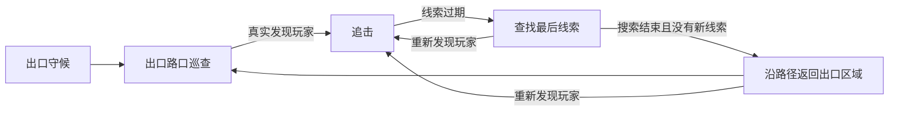

# 怪物与遭遇节奏优化方案

状态：已按 15 秒无接触、脱战后 10 秒并行保护、休息夜 20 秒实施；已完成本轮对照、场景回归和独立种子验收。结果见 [实施与测试记录](monster-balance-results-2026-09-11.md)。依据：[听声者与畏光者专项测试](listener-light-assessment-2026-09-11.md)。

目标是让玩家用正确操作获得逃离机会，脱战后仍可能在任务路线上再次遇怪；最终阶段保持拦截压力，同时减少连续贴身挨打。实施顺序为：补足归因记录 → 巡逻者收招 → 诱饵接收规则 → 出口职责 → 日常巡逻覆盖。先落实逃离窗口，再提高接触机会。各项独立对照，最后组合验收。

## 一、保留的设计

- 哭泣者：惊动后需要一个闪光处理；触发、追杀、第五夜起随机游荡的规则保持现状。
- 怪物数量：日常一只主怪，哭泣者独立；第四夜起最终阶段增加一只出口巡逻者。
- 听声者：安静移动可脱离近距听觉；闪光击退、约一秒眩晕失聪，恢复后能重新听见冲刺。
- 畏光者：照光退缩后有转身逃离窗口；反复开灯不刷新冷却。闪光约四秒、诱饵对可见追击约 0.65 秒停顿。
- 巡逻者原有视线丢失与重新锁定规则保留：遮挡后搜索，重新曝光需要连续视线，极近接触仍危险。
- 第一、二夜的教学保护、初始物资与出生间距保留。第三夜不增加日常遭遇调度。
- 速度、伤害、体力、破门时间、背包数量和补给量沿用当前版本，本轮只调整行为及节奏。所有新参数先按候选值验证。

## 二、先补足归因记录

当前报告已经能测压力、伤害和脱战，但伤害事件只记扣血量，道具事件记录的是使用后最近的怪物。整体优化前补充三类直接记录：

| 记录 | 必需内容 | 用途 |
|---|---|---|
| 实际受伤 | 攻击者实例、种类、阶段、扣血量 | 分开主怪、出口巡逻者、哭泣者和环境伤害 |
| 实际控制 | 道具实例、命中的怪物、控制开始/结束原因 | 避免击退后最近怪物改变，导致归因错误 |
| 决策切换 | 原状态、新状态、线索/声源、接受或拒绝原因 | 解释突然转向，区分失去线索、被控制、收招和返回出口 |

新增收招计时后，同时统计“控制或收招提供的行动窗口”和“所有敌人都失去线索的真正脱战”，二者分别记录，不能因为怪物短暂停步就算已经甩脱。

诊断代码仅观察结果，不参与怪物决策。指标版本改变后重跑一次同版本基线；未解决的仓库空任务箱绕路样本继续保留并排除对应配对，不把修复机器人算法与游戏调参混在一轮。现有无报警配对可用于初轮比较，不能用通关率代替压力和逃离机会。

## 三、巡逻者命中后短暂收招

**问题：** 仓库样本中的出口巡逻者持续贴身，玩家反复在共享伤害保护结束后受伤。现在只有玩家的 1.8 秒伤害保护，攻击者没有命中后的动作停顿。

**候选改动：** 主怪巡逻者与出口巡逻者采用同一规则：真正扣血后收招 **0.7 秒**，停止移动和攻击，保持朝向与已有线索。结束后依据当时有效的视线或记忆继续行动。它不会因为命中一次就突然转去巡逻。

- 只对造成此次实际扣血的攻击者启动收招；碰到无敌中的玩家不能再次触发收招，也不能使其他怪物一起停下。
- 保留玩家现有 1.8 秒伤害保护，不叠加新的全局无敌。
- 收招期间闪光照常生效；收招、眩晕、诱饵停顿按各自计时更新，移动需要所有相关限制结束，避免后一个较短效果覆盖较长控制。
- 收招不清除追击目标、不恢复玩家体力；玩家仍需要移动、利用拐角或使用道具。
- 暂停冻结计时，重开与下一夜清空状态。门前收招也要暂停该攻击者的撞门贡献，不影响其他合法攻击者。
- 用停步收势与既有命中声表达；在真实绘制的画面里确认能看出停顿。如现有精灵帧不足以表达，再单独补收招帧。

0.7 秒内玩家理论可步行约 58、冲刺约 88 世界单位，实际收益受碰撞和体力限制。这是试验起点，不是已证实的最佳时长。先比较当前版本与 0.7 秒；只有不足或过强的明确证据出现时，再试 0.6 或 0.8 秒。

**验收：** 相同仓库输入策略下，连续贴身受伤应减少，至少能在受控转角场景中利用收招离开接触范围；原地站着仍会再次受伤，不能形成无消耗的永久控制。保持视线时不得无故放弃追击。

## 四、诱饵先被听见，再改变行动

**问题：** 约 500 单位外的诱饵能让听声者和畏光者转向，虽然同处的普通响声被拒绝。仅给停顿加距离限制不能解决调查目标穿透范围的问题。

第一版采用独立的诱饵范围配置，数值如下。巡逻者沿用当前诱饵的 180 范围，不直接套用其普通活动声的 100 范围。

| 怪物 | 诱饵接收范围 | 墙体 | 接收后效果 |
|---|---:|---|---|
| 听声者 | 小于 260 | 沿用可隔墙听声的规则 | 调查声源，最多持续到诱饵剩余寿命结束 |
| 畏光者 | 小于 180 | 使用当前活动声的无遮挡条件 | 可见追击短暂停顿；未看见玩家时调查最多两秒 |
| 巡逻者，包括出口怪 | 小于 180 | 使用当前活动声的无遮挡条件 | 保留当前短暂停顿/有限调查和冷却 |

诱饵总寿命保持八秒。范围过滤会减少远处怪物被突然引走的情况，也可能提高某些路径的难度，须与此前的收招改动分别评估。

具体接收契约：

1. 声源具有稳定的实例标识、固定位置、类型和结束时间。新投出的诱饵是新实例；同一个诱饵不能每帧刷新停顿。
2. 仍在发声的诱饵允许怪物走入范围后听见。此前因距离或遮挡拒绝的声源不能被永久标记为已处理。
3. 接收后记住固定声源位置和剩余时间；怪物离开接收边界不会立即来回切换目标。迟到的听声者也不会凭空获得完整八秒。
4. 眩晕失聪期间不接收新声源。恢复后若声源仍有效，可以按范围和种类规则重新判断。
5. 没听见的诱饵不能清除追击线索、取消破门或改变出口目标。听见后是否让位给新视线，沿用各怪的反制特点。
6. 手持诱饵和环境机器都通过同一接收入口；第一版沿用上述范围，环境机器当前发声寿命保持不变。哭泣者的声音触发流程不接入此次改造。
7. 每只怪物每帧只推进一次响应计时。先得出已接受的行动意图，再供追击、破门和出口分支使用，避免各分支分别读取未经筛选的全局声源。

**验收：** 500 单位外的诱饵不再改变目标；范围内的原有停顿仍有效；墙两侧、走入范围、声源到期、重复使用、眩晕结束及同帧破门均有实际场景检查。

## 五、出口巡逻者围绕出口承担拦截职责

**问题：** 开箱时只计算一次拦截路线，之后一直使用第一个点。怪物有时离开撤离路线，在旧点附近持续搜索；有时又长时间贴着玩家追击。

保留出口出生和六秒守候，以及看见近处玩家时提前响应。守候之后，在出口前的 **两个可达路口** 之间巡查。路口优先取距出口步行路径约 **180–360 单位** 的位置，避开出口交互点，保留玩家可绕行或用道具突破的空间。距离与数量均为候选值；某张地图只有一个合法路口时使用一个路口加局部巡查，不放到非法位置。

行动流程：

- 追丢后的局部搜索先试 **三秒**。前往旧线索另有 **四秒**行进预算，只有无新线索时才计时，避免把整个倒计时耗在远处旧目标上。
- 不因计时器到点而打断仍有新视线、近身接触或正在生效的控制。搜寻结束的返回行为必须有明确的失去线索原因。
- 返回和巡查采用真实路径，能够重新察觉玩家。更新路口时不读取被遮挡玩家的实时位置；只因到达路口、门/通路变化、不可达或搜索结束而选择新目标。
- 如果计划路线不可达，尝试其他出口路口；不能永远在最近可达点打转，也不能直接移动到新位置。
- 留在远处房间的玩家由主怪的合法开箱线索、破门和现有开箱闪现机制施压；出口怪无需冲到箱子旁承担同一职责。

**验收：** 直接回出口、关门等待、第一次遇敌后改道三类路线都测试。出口怪在失去线索后能够回到撤离区域，在真实看见玩家时能再次拦截。站桩等待不能消除整段最终阶段的威胁；玩家连续成功反制后安全撤离属于正常结果，不要求强制受伤。

## 六、日常巡逻覆盖：先改路线，再看是否仍需加压

**问题：** 中庭逐箱搜索约 67 秒，主怪有效威胁仅约一秒。固定巡逻点顺序与仅对离场怪物生效的补偿，无法改善仍在远处常驻的怪物。附近搜索基准中，第二、四、六夜的日常阶段中位数分别约 37.5、40.2、37.8 秒；原先提出的 35 秒改派阈值接近日常阶段结束，尚未计入改派后的行进时间，已撤回。

把现有出生点、入口、主要路口与任务区域整理成可达的巡逻点集合，按“最近是否访问、区域覆盖、行进成本”选择下一段路线。同一时间仍只有一只主怪，不新增日常刷新或传送。

候选调度规则：

| 条件 | 处理 |
|---|---|
| 第一至第三夜 | 保留当前日常调度，先确认教学与巡逻者收招效果 |
| 第四夜起、最后任务箱之前 | 使用区域轮换巡逻；巡逻点变化需等当前搜索完成或到达当前路口 |
| 约 15 秒没有有效接触 | 在空闲巡逻状态下安排下一个覆盖不足的区域，不给出玩家坐标 |
| 刚刚成功脱战 | 十秒内不因“压力不足”额外改派路线；原有巡逻和真实视听察觉仍然有效 |
| 正在追击、破门、受控或哭泣者已造成近身压力 | 不触发额外的日常改派 |
| 无限模式休息夜 | 无接触阈值先试 20 秒，其他机制不变 |

十五秒无接触与脱战后十秒不额外改派是两个并行条件，不能相加成二十五秒后才开始走。首次接触前，从主怪激活、出生预警及开场保护都结束后开始计无接触时间；发生有效接触后重新计时。每次改派只选定一段实际巡逻路线，在到达、不可达或出现新线索前不因计时器逐帧更换目标。

正常探索路线先以脱战后约 **20–25 秒内重新出现可感知接触机会** 为观察目标，纳入实际行进时间；超过该区间的样本检查路线覆盖和距离。它不是按秒强制遇敌的承诺，主动安静绕行可以继续避开怪物，也不会为满足指标而取得隐藏玩家坐标。区域轮换巡逻本身承担覆盖任务，十五秒检查用于修正长期没有接触的路线。

有效接触与怪物存在时间分开统计。刷新、持有远处旧线索、处于控制中，都不能单独证明玩家正承受追击压力。调度可以使用地图区域覆盖和公开任务进度安排巡视，不能把玩家隐藏位置写入怪物记忆；再次追击仍要通过该怪的真实感知。

**验收：** 中庭逐箱搜索样本出现更多实际可感知接触，且每次转向都有合法原因；主动安静绕行仍然能避开怪物。十秒保护只限制额外调度，不是碰到玩家也不追的全局安全时间。若巡逻覆盖改善却使连续受伤、补给消耗普遍上升，先调整巡逻路线与改派间隔。

## 七、验证与实施批次

| 批次 | 唯一主要改动 | 首要验证 |
|---|---|---|
| 0 | 伤害、命中与决策归因 | 同帧治疗/受伤、一次闪光命中多怪、击退后归因；重建同指标基线 |
| 1 | 巡逻者 0.7 秒收招 | 仓库连续受伤、转角脱离、站立仍危险、暂停与重开 |
| 2 | 声源接收与诱饵范围 | 听声者/畏光者日常与 121 速度专项；近距反制、墙体、破门优先级 |
| 3 | 出口巡查与有限搜索 | 七图的直返、关门等待和改道；再次拦截与可突破性 |
| 4 | 第四夜起日常区域巡逻 | 中庭逐箱搜索、成功脱战后的安静窗口、休息夜 |
| 5 | 组合检查 | 首七夜、全部 21 种地图与主怪组合、混合哭泣者、独立种子 |

每批同时比较原基线、单项候选与已接受改动的组合，使用一致的种子、策略、指标和时长。调参只使用既有校准种子；最终独立种子在确认未用于既往调参后选取。留出集只做一次最终验收，不能反复用于挑参数。

首两夜以保留学习空间为约束；第三夜与仓库以减少连续贴身受伤为重点；中庭以改善接触机会为重点。最终 30 秒同时看受伤、控制收益、实际接近、再次遭遇和安全窗口，不设一个必须达到的统一压力百分比，也不要求机器人全部通关。

候选收敛后运行 `npm test` 的普通测试与 1,400 组地图池，以及相关实际场景回归；不新增独立重型 CPU 池。本地最多两路浏览器任务。需要导出或修改布局时只操作 LDtk 源，不编辑生成地图 JSON。最后用真实绘制回放和浏览器操作检查收招、闪光与转身逃离的可见效果。

本方案优先复用声音、动画与现有提示。如后续确需新增玩家文案，按项目语义本地化键、全部语言目录、字体和浏览器检查要求处理。

## 八、预计涉及的代码

- `src/endless.ts`：主怪攻击结算、声源接收时序、破门意图、日常调度、出口目标调度。
- `src/runtime/reinforcement.ts`：巡逻者收招、有限搜索与返回；和主怪共用收招规则。
- `src/runtime/distraction-response.ts`、`src/run-rules.ts`：诱饵范围、每个实例的接收与响应，保留听声/视线差异。
- `src/runtime/patrol-density.ts`、`src/runtime/pursuit.ts`：出口路口和日常可达巡逻点选择；继续从最后感知位置搜索。
- `scripts/balance/` 与对应浏览器测试：直接归因、场景验证和同条件比较；测试策略修复另行冻结版本。

不通过批量改速度、增加怪物数量或增加物资来抵消行为问题。每批都必须能说明改了什么、改善了哪类场景，以及哪些场景付出了代价。
